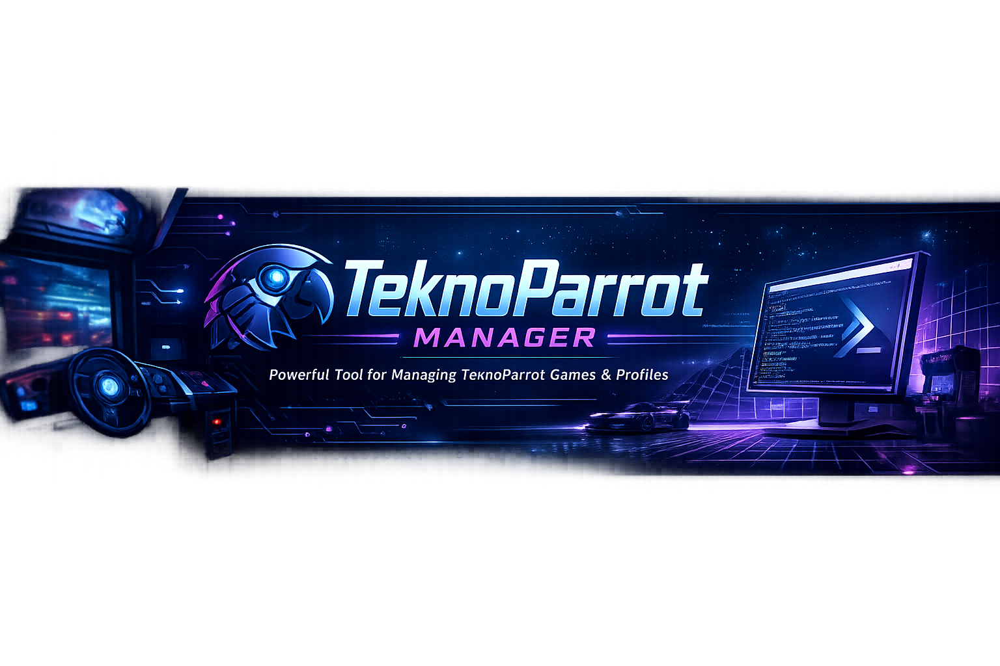

# TeknoParrot Manager



A PowerShell 5.1 script that automates setting up and managing a TeknoParrot arcade game library on Windows — registration, control propagation, crosshairs, ReShade, dgVoodoo2, GPU fixes, and more.

> **Beta** — test one game after each run. Profiles are backed up automatically before every run.

---

## Table of Contents

- [Features](#features)
- [Glossary](#glossary)
- [How It Works](#how-it-works)
- [Requirements](#requirements)
- [Installation](#installation)
- [Running the Script](#running-the-script)
- [Modes](#modes)
- [Game Selection (AutoSync)](#game-selection-autosync)
- [The Staging Folder](#the-staging-folder)
- [Registration](#registration)
- [How Fuzzy Matching Works](#how-fuzzy-matching-works)
- [Dat File Integration](#dat-file-integration)
- [Control Propagation](#control-propagation)
- [Device Survey](#device-survey)
- [Crosshair Setup](#crosshair-setup)
- [ReShade Visual Enhancements](#reshade-visual-enhancements)
- [dgVoodoo2 Legacy Compatibility](#dgvoodoo2-legacy-compatibility)
- [GPU Compatibility Fixes](#gpu-compatibility-fixes)
- [Force Feedback (FFB) Setup](#force-feedback-ffb-setup)
- [BepInEx Update Check](#bepinex-update-check)
- [Postgres Setup](#postgres-setup)
- [LaunchBox Integration](#launchbox-integration)
- [HyperSpin 2 Export](#hyperspin-2-export)
- [RetroBat / Batocera](#retrobat--batocera)
- [Thumbnail Download](#thumbnail-download)
- [Controls Status File](#controls-status-file)
- [Per-Game Overrides](#per-game-overrides)
- [Action Required Summary](#action-required-summary)
- [Unattended / Scheduled Mode](#unattended--scheduled-mode)
- [Preview / Dry-Run Mode](#preview--dry-run-mode)
- [Game Repair](#game-repair)
- [Safety, Backup and Log](#safety-backup-and-log)
- [Resetting](#resetting)
- [Troubleshooting](#troubleshooting)
- [What It Does Not Do](#what-it-does-not-do)
- [Files Reference](#files-reference)
- [Support / Contributing](#support--contributing)
- [License](#license)

---

## Features

- **Auto-registration** — scans your extracted games and copies the matching TeknoParrot profile with the correct game path. Scans `.exe`, `.elf`, `.iso`, `.xbe` (Sega Chihiro/cxbxr games such as Virtua Cop 3 and OutRun 2), `.dll` (Konami PC arcade games such as DanceDanceRevolution 2013 and Steel Chronicle), and more. Existing registrations are never overwritten.
- **Fuzzy name matching** — handles shared-executable platforms (NESiCAxLive, etc.) by comparing folder names to profile codes and auto-registering the best match above a confidence threshold.
- **Dat file integration** — downloads or reads the Eggman/RomVault dat ZIP to resolve shared executables, register games with no known exe (pcsx2x6, ELF-based Lindbergh titles), and handle misnamed folders.
- **Profile code matching** — a third registration pass Dice-matches folder names directly against TeknoParrot profile code names, resolving games whose profile has an empty `ExecutableName` (BladeStrangers, LuigisMansion, MaiMaiGreen, PokkenTournament, and others) without needing a dat entry.
- **GitHub profile resolution** — fetches the full GameProfile list from the TeknoParrot repo on each launch to resolve dat codes that don't exactly match a local template.
- **Control propagation** — bind one game of each control type once; the script copies those settings to every other game of the same type.
- **AutoSync extraction** — copies and extracts game ZIPs from a NAS or local source, skipping unchanged games.
- **Game repair** — finds broken or empty game paths and re-points them automatically.
- **Crosshair setup** — deploys custom P1/P2 cursor images to all lightgun games with an HTML preview of 321 included designs.
- **ReShade** — installs post-processing into game folders, auto-detecting the correct DLL name and 32/64-bit architecture per game. Checks the Authenticode signature on your ReShade DLL(s) before deploying, since ReShade's own installer is code-signed.
- **dgVoodoo2** — fixes older games that crash on DirectX 8, DirectDraw, or Glide by deploying the correct compatibility DLLs.
- **GPU fixes** — detects your GPU (AMD / NVIDIA / Intel) and applies the matching vendor fix to every registered game that has one.
- **Force feedback (FFB)** — native FFB Blaster (needs a paid TeknoParrot membership) and a free third-party plugin (fetched live, no subscription needed), covering different games. If a game is covered by both, you're asked once which to use for all such games.
- **BepInEx update check** — checks games that already have BepInEx installed against the latest stable 64-bit release and offers a batched update. Never installs BepInEx fresh.
- **Postgres setup** — installs and configures the local PostgreSQL 8.3 database some Incredible Technologies games need (Golden Tee Live, Power Putt Live, Silver Strike Bowling Live, Target Toss Pro, Orange County Choppers Pinball). Detects which registered games need it automatically; never reinstalls Postgres or recreates an existing database.
- **Automatic compatibility warnings** — every run checks for known install-path-length limits (Raw Thrills titles, Yu-Gi-Oh! Duel Terminal 6), pinned-file-version requirements (BlazBlue/iDmacDrv32.dll, Tekken Tag Tournament 2/EBOOT.BIN), and known GPU-vendor incompatibilities (AMD/Intel), with details in ACTION REQUIRED.
- **Game-specific setup notes** — every run checks the community compatibility database (eggmansworld.github.io/TeknoParrot) for any registered game with special setup notes — workarounds, known quirks, the expected executable name — and lists them in ACTION REQUIRED.
- **LaunchBox direct integration / HyperSpin 2 export** — writes games straight into LaunchBox's own library, or builds an import file for HyperSpin 2, after each run.
- **Unattended mode** — `-Unattended` flag for scheduled overnight runs.
- **Preview / dry-run mode** — see what AutoSync/Register would do (extract, register, repair, propagate) with zero files written, then decide whether to apply it for real.
- **Download audit logging** — every binary fetched from a third party (Eggman dat ZIP, BepInEx release, FFBArcadePlugin DLLs) has its source URL, filename, version, and SHA256 logged for later verification or troubleshooting.
- **Safe by design** — timestamped backups before every run, free-space check, full log, one-click restore.

---

## Glossary

Terms used throughout this README, in the order you're likely to need them.

| Term | Meaning |
|---|---|
| **GameProfile** | The template TeknoParrot ships for one specific game (e.g. `StreetFighterIII3rdStrike.xml`). Lives in TeknoParrot's `GameProfiles\` folder. Defines what fields/buttons that game has, but isn't itself pointed at your copy of the game. |
| **UserProfile** | Your own copy of a GameProfile, created when a game is registered. Lives in `UserProfiles\`, one file per registered game — this is the file with your actual `GamePath`, control bindings, and per-game settings. |
| **Profile Code** | The filename (without `.xml`) shared by a GameProfile and its UserProfile, e.g. `StreetFighterIII3rdStrike`. Used throughout this script and its logs to refer to one specific game profile. |
| **GamePath** | The field inside a UserProfile pointing at that game's actual executable on disk. Registration is, at its core, finding the right exe and writing it into this field. `GamePath2` is the same idea for games needing a second executable (see `HasTwoExecutables`). |
| **Registration** | Matching an extracted game folder to the correct GameProfile and creating/updating its UserProfile with the right GamePath. See [Registration](#registration). |
| **AutoSync** | This script's combined extract-and-register mode (mode 1) — pulls ZIPs from your NAS/local source into a staging folder, then registers whatever it extracted. See [Game Selection (AutoSync)](#game-selection-autosync). |
| **Staging folder** | The local folder AutoSync extracts ZIPs into before registration. See [The Staging Folder](#the-staging-folder). |
| **Fuzzy matching** | How this script figures out which GameProfile an extracted folder belongs to when the executable name alone is ambiguous. Compares the folder name against each candidate profile's code. See [How Fuzzy Matching Works](#how-fuzzy-matching-works). |
| **Dat file** | An optional community-maintained index (Eggmansworld TeknoParrot collection) mapping exact ZIP names to the right profile code — used instead of fuzzy matching for ambiguous games when available, since it's exact rather than a best guess. |
| **Control propagation** | Bind ONE game per control type (button/driving/lightgun/trackball/analog) in TeknoParrot's own UI, and this script copies those bindings to every other unbound game of that type. See [Control Propagation](#control-propagation). |
| **Archetype / reference game** | A game with enough buttons already bound (by you) to be used as the propagation source for its control family. Never modified by propagation itself — only ever a source, never a target. |
| **Family** | Which kind of controls a game uses — button / driving / lightgun / trackball / analog. Auto-detected per game; overridable in `overrides.json`. |
| **ACTION REQUIRED** | The end-of-run summary listing everything still needing your attention in TeknoParrotUI — games needing manual registration, paths to fix, missing bindings. See [Action Required Summary](#action-required-summary). |
| **Dry-run / preview mode** | Runs AutoSync or Registration showing exactly what would happen, without writing anything. Offered automatically before a real run in modes 1/2. |
| **Overrides (`overrides.json`)** | An optional file next to this script for overriding automatic choices per game — skip syncing one, pin a game to a specific archetype, override its detected family, and a few other exceptions. See [Per-Game Overrides](#per-game-overrides). |
| **HasTwoExecutables** | A GameProfile property (e.g. Initial D: Arcade Stage games) meaning the game needs a second companion executable launched alongside the main one. Handled automatically via `GamePath2`. |

---

## How It Works

TeknoParrot keeps two profile folders in its root:

| Folder | Purpose |
|--------|---------|
| `GameProfiles` | Templates that ship with TeknoParrot, one per supported game. Each names the executable it expects and carries that game's settings and controls. |
| `UserProfiles` | Your games. A game appears and launches once its template is copied here with the path to your executable filled in. |

This script automates the copy-and-fill step: it scans your games, matches each executable to the right template, copies it to `UserProfiles`, and sets the path. TeknoParrot picks the games up on its next launch.

---

## Requirements

- Windows 10 or 11
- PowerShell 5.1 (built into Windows — no install needed)
- TeknoParrot installed with `TeknoParrotUi.exe` run at least once (so it downloads its `GameProfiles` folder)
- Your games as ZIP files (for AutoSync) or already extracted into subfolders

---

## Installation

1. Download `TeknoParrot Manager vX.XX BETA.zip` from [Releases](../../releases/latest)
2. Extract to any folder (e.g. a `Scripts` subfolder alongside your TeknoParrot install)
3. Double-click **`TeknoParrot-Manager.bat`**

No additional software required to get started. Optional tools (ReShade, dgVoodoo2) are configured separately — see their sections below.

---

## Running the Script

**Option A — Double-click launcher (easiest):**
```
TeknoParrot-Manager.bat
```

**Option B — PowerShell directly:**
```powershell
cd "C:\path\to\TeknoParrot\Scripts"
.\TeknoParrot-Manager.ps1
```

**Blocked by execution policy?**
```powershell
powershell -ExecutionPolicy Bypass -File .\TeknoParrot-Manager.ps1
```

On first run the script scans common install locations for `TeknoParrotUi.exe` automatically before asking you to type a path. If multiple installs are found they are listed numbered for easy picking.

Any time you're asked to type a file or folder path, type `B` instead to open a native Windows browse dialog and pick it visually — typing the path directly still works exactly as before.

On later runs it offers to reuse your saved settings — press **Y** to continue, **N** to reconfigure.

---

## Modes

The main menu is a persistent loop — after each mode finishes you return to the menu.

Choosing mode 1 or 2 offers a preview/dry-run option first — see [Preview / Dry-Run Mode](#preview--dry-run-mode).

| # | Mode | What it does |
|---|------|-------------|
| 1 | **AutoSync** | Extract ZIPs from NAS or local source, then register |
| 2 | **Register only** | Games already extracted — just register |
| 3 | **Crosshair setup** | Pick and deploy custom crosshairs to lightgun games |
| 4 | **ReShade setup** | Install post-processing shaders |
| 5 | **dgVoodoo2 setup** | Fix DirectX 8 / DirectDraw / Glide compatibility |
| 6 | **GPU fix setup** | Apply AMD / NVIDIA / Intel vendor fix to all games |
| 7 | **Force feedback (FFB) setup** | FFB Blaster (membership) + free third-party plugin |
| 8 | **BepInEx update check** | Update an existing BepInEx install to the latest stable 64-bit release |
| 9 | **Restore backup** | Roll TeknoParrot profiles, LaunchBox's library files, or Postgres databases back to a previous backup |
| 10 | **Library health check** | Read-only registered/broken/empty status, plus GPU fix / FFB Blaster / dgVoodoo2 / Postgres coverage and ReShade/BepInEx install counts |
| 11 | **Postgres setup** | Installs/configures the local PostgreSQL database some Incredible Technologies games need (Golden Tee Live, Power Putt Live, Silver Strike Bowling Live, Target Toss Pro, Orange County Choppers Pinball) |
| 12 | **Exit** | Quit the script |

---

## Game Selection (AutoSync)

After entering your folders, the script filters out games already on disk and shows a combined list from all configured sources. When a supplementary library is configured, both collections are merged into one picker and supplementary entries are marked `[+]`:

```
347 game(s) already extracted -- not shown.
136 game(s) available to extract (104 collection, 32 supplementary [+]).

A) All unextracted games (136)
L) Browse and select from list (136 games, A-Z)
S) Search by keyword
D) Done -- proceed with current queue
```

- **A** — extract everything not already on disk. Fastest option for a full library.
- **L** — paginated A-Z list, 20 at a time. Type numbers or ranges (`1,3,5-7`) to add games. `[+]` marks supplementary titles. Commands: `N` next page, `P` previous, `B` back, `D` done.
- **S** — search by keyword. Type numbers or ranges to add matches. Type `back` to return or `done` to finish.
- **D** — proceed with the current queue. You can mix Browse and Search sessions to build a queue before pressing D.

Games already in your queue are marked with `*`. A real-time progress bar shows file count and percentage during each extraction.

---

## The Staging Folder

AutoSync extracts games into a staging folder you choose. Rules:

- **Recommended: local drive** for best performance. Network drives are allowed but the script measures write speed and warns if throughput is insufficient for smooth extraction or gameplay.
- Must **not** be inside the TeknoParrot folder
- Must **not** overlap the ZIP source folder
- The script warns if the drive has less than ~1.5x the total ZIP size free

Interrupted extractions are handled automatically: a `.extracting` sentinel file is placed next to the game folder at the start and removed only on success. If the sentinel is found on the next run, the incomplete folder is detected and the game is re-extracted from scratch.

---

## Registration

For each game folder, there are four possible outcomes:

| Result | Meaning |
|--------|---------|
| **Registered** | A matching profile was found and the game now appears in TeknoParrot. |
| **Registered (fuzzy)** | The exe name is shared by multiple games (e.g. `game.exe` for 80+ NESiCAxLive titles) but the folder name matched a specific profile with high confidence. Profile code and score shown — spot-check these. |
| **Registered (dat)** | The folder name matched a dat file entry. The dat's authoritative profile code and executable path are used. Covers shared-exe games, exe-less-matched folders (pcsx2x6, ELF-based), and slightly misnamed folders. |
| **Registered (code/fuzzy)** | Folder name matched a TeknoParrot profile code by Dice similarity. Used for games whose profile has an empty `ExecutableName` (BladeStrangers, LuigisMansion, etc.) — the best available executable in the folder is selected. |
| **Already set** | A profile for this game already exists and is left exactly as-is. |
| **Register manually** | Shared exe, folder name below confidence threshold. The ACTION REQUIRED section shows the exe to browse to, a best-guess profile, and the full candidate list. |

---

## How Fuzzy Matching Works

Many platforms share a single executable across all their titles — on NESiCAxLive every game uses `game.exe`. The script compares the **folder name** of each game to every candidate profile code using a Sørensen–Dice bigram similarity score.

**Example:**

```
Folder:  "Akai Katana Shin (2012)[Taito NESiCAxLive][TP]"
Profile: "AkaiKatanaShinNesica"

After normalisation:
  Folder:  "akaikatanashin"
  Profile: "akaikatanashinnesica"

Dice score: ~0.85  -->  auto-registered
```

**Thresholds:**

| Score | Action |
|-------|--------|
| >= 0.72 | Auto-registered. Shown in cyan with score — spot-check. |
| >= 0.40 | Flagged in ACTION REQUIRED with best-guess profile shown. One click in TeknoParrotUI to confirm. |
| < 0.40 | Flagged in ACTION REQUIRED with full candidate list only. |

**What is stripped during normalisation:** square-bracket metadata, bare 4-digit years, ISO dates, decimal versions, region codes (JPN/USA/EUR/etc.), version strings with prefix (ver/rev/v). Meaningful names like `(Special Edition)` are kept intentionally.

**Wrong match?** Delete the game's `.xml` from `UserProfiles` and add a `forceArchetype` entry in `overrides.json` to pin it on the next run.

---

## Dat File Integration

During initial setup the script offers to configure the Eggman/RomVault dat:

```
D) Download from GitHub now  (~145 MB)
Z) I have the ZIP already -- enter path
F) I have separate dat files -- enter paths
N) Skip
```

Both the collection dat and supplementary dat are read directly from inside the ZIP — no extraction needed. The supplementary dat takes priority for any game that appears in both (alternate versions that replace the collection version).

The dat resolves three registration scenarios that would otherwise require manual intervention:
1. **Shared-executable games** (NESiCAxLive, etc.) — dat disambiguates instantly using the folder name
2. **Games with no profile match** (pcsx2x6, ELF-based Lindbergh) — a second pass looks them up by normalised folder name
3. **Slightly misnamed folders** — fuzzy scan of all dat entries

A third registration pass (independent of the dat) Dice-matches normalised folder names against normalised profile code names. This resolves games whose GameProfile has an empty `<ExecutableName>` — they never enter the exe-name index and may not be in the dat either. Examples: BladeStrangers, LuigisMansion, MaiMaiGreen, PokkenTournament, ProjectDiva, SonicDashExtreme, HydroThunder.

The script also fetches the full list of `GameProfile` filenames from the `teknogods/TeknoParrotUI` GitHub repo at launch to resolve dat codes that don't exactly match a local template filename (e.g. `BladeArcusFromShining` → `BladeArcus.xml`). Falls back to scanning your local `GameProfiles` folder if offline.

Games registered via the dat are shown as `Registered (dat/exact)` or `Registered (dat/fuzzy)`.

---

## Control Propagation

Bind ONE game of each control type in TeknoParrotUI; the script copies those controls to every other game of the same type.

**Good reference games to bind first:**

| Type | Suggestions |
|------|------------|
| Fighting / buttons | Street Fighter III, BlazBlue, Tekken 7, Dead or Alive 5 |
| Driving | Daytona Championship USA, Initial D, OutRun 2 SP, F-Zero AX |
| Lightgun | House of the Dead 4, Aliens Extermination, Point Blank |
| Trackball | Golden Tee Live, Silver Strike Bowling, Target Toss Pro |

**How to use it:**
1. In TeknoParrotUI, fully bind one game of each type — buttons, axes, Test, Service, Coin, Start
2. Re-run this script. Propagation runs automatically after registration
3. Launch ONE updated game and test it before trusting the rest

**How matching works:** each control is matched by function so a steering axis is never copied onto a gun axis. Mixed device setups (e.g. Xbox stick + arcade buttons) copy across intact.

**What stays manual:** game-specific controls that don't exist in the reference game, and any type for which no reference has been bound yet. Both are reported in ACTION REQUIRED.

If anything goes wrong, restore from the backup made at the start of the run.

---

## Device Survey

On first run (or on request), the script asks which controls you have — Xbox pad, arcade stick, trackball, spinner, wheel, lightgun, keyboard — and prints a tailored plan of which game to bind with which device. Reads nothing and changes nothing.

---

## Crosshair Setup

Mode 3 deploys custom P1/P2 crosshair cursor images to all registered lightgun games. Can also be run standalone at any time from the main menu.

**How TeknoParrot uses crosshairs:**
- **Standard games** — `P1.png` + `P2.png` in the game's executable folder
- **ElfLdr2 games** — shared pair in the ElfLdr2 loader folder (auto-detected)
- **Pcsx2x6 games** — shared pair in the pcsx2x6 emulator folder; `inis\PCSX2.ini` is also updated with `cursor_path` under `[USB Port 1 guncon2]` and `[USB Port 2 guncon2]`

**How to use it:**
1. An HTML preview grid opens in your browser showing all 321 included designs
2. Enter the index number for your P1 and P2 crosshairs (can be the same) — the script remembers your last choice by filename and offers it as a default, so a re-run is just pressing Enter twice
3. The script copies the images to every registered lightgun game
4. Optionally set cursor-hide for all gun games (backs up profiles first)

**Adding your own crosshairs:** drop any PNG into the `Crosshairs\` folder next to the script. No naming convention required, though numbering helps. The script validates against the PNG magic-byte signature before including any file.

321 crosshair designs (000.png–320.png) are included. Source: [emuline.org](https://www.emuline.org/topic/3080-custom-crosshairs-emulators-loaders/)

---

## ReShade Visual Enhancements

ReShade adds post-processing effects to games without modifying any game files. Remove it by deleting one DLL per game folder — the game is completely unchanged.

**Popular effects for arcade games:**

| Effect | What it does |
|--------|-------------|
| LumaSharpen / CAS | Removes the blurry look of upscaled games |
| CRT_Royale / CRT_Lottes | Adds classic CRT scanlines and curvature |
| Levels / Vibrance | Restores vivid colours on modern monitors |
| Border | Adds decorative arcade cabinet artwork in black bar areas |

**Setup:**

The script looks for DLLs in a `ReShade\` folder next to the script:
- `ReShade64.dll` — for 64-bit games (required)
- `ReShade32.dll` — for 32-bit games (optional)

**If you downloaded the ZIP release:** DLLs are already included. Skip to running mode 4.

**If you cloned from GitHub (DLLs not in repo):**
1. Download the free installer from [reshade.me](https://reshade.me)
2. Run it — point it at any 64-bit TeknoParrot game exe. It creates a DLL in that folder.
3. Copy that DLL to `ReShade\ReShade64.dll` next to the script
4. (Optional) Repeat with a 32-bit exe and save as `ReShade32.dll`
5. Run mode 4 or answer Y when prompted after a normal run

**In-game:** press **Home** to open the ReShade overlay. Toggle effects with tick-boxes, adjust with sliders. Settings save automatically to `ReShade.ini` in the game folder.

**Updating:** the script checks reshade.me for newer versions each run. To update: download the new installer, extract the DLL, replace `ReShade64.dll`, re-run mode 4.

**Signature check:** before deploying, the script checks the Authenticode signature on your ReShade DLL(s) — ReShade's own installer is code-signed, and that signature survives extracting/renaming the DLL. An invalid or missing signature is shown as a warning (with a plain-English reason) but doesn't block setup, since you supplied the file yourself; just make sure it actually came from reshade.me.

**Removing:** delete the DLL (`dxgi.dll`, `d3d9.dll`, `d3d12.dll`, or `opengl32.dll`) from the game folder. Optionally delete `ReShade.ini` as well.

Mode 10 (Library health check) reports, purely informationally, how many registered games have ReShade installed -- not flagged as something to fix, since it's a per-game cosmetic choice rather than a clear right answer.

---

## dgVoodoo2 Legacy Compatibility

Some older arcade games use DirectX 8, DirectDraw, or the 3dfx Glide API. On modern PCs these cause crashes, black screens, or missing geometry. dgVoodoo2 intercepts those old calls and re-issues them as DirectX 11/12 commands.

**Only use this if a game crashes or shows a black screen on first launch.** Games that run correctly do not need it.

**What it fixes:**

| Import | DLLs deployed |
|--------|--------------|
| `d3d8.dll` | `D3D8.dll` + `D3DImm.dll` |
| `ddraw.dll` | `DDraw.dll` + `D3DImm.dll` |
| `glide2x.dll` | `Glide2x.dll` |
| `glide3x.dll` | `Glide3x.dll` |

**Setup:**
1. Download dgVoodoo2 from [dege.freeweb.hu](https://dege.freeweb.hu/dgVoodoo2/dgVoodoo2/)
2. Create a `dgVoodoo2\` folder next to this script and copy in:
   - From `MS\x86\`: `D3D8.dll`, `DDraw.dll`, `D3DImm.dll`
   - From `3Dfx\x86\`: `Glide2x.dll`, `Glide3x.dll`
   - From the ZIP root: `dgVoodoo.conf`
3. Run mode 5 or answer Y when prompted after a normal run

The wizard scans every registered game exe for legacy API imports and shows auto-detected games first. You can install to all at once or pick individually.

**Removing:** delete the deployed DLLs from the game folder. Nothing else is changed.

Mode 10 (Library health check) reports which registered games import a legacy API but don't have the matching DLL deployed yet, read-only and without changing anything.

---

## GPU Compatibility Fixes

Many TeknoParrot games include optional per-vendor fix settings (AMD, NVIDIA, Intel). Mode 6 auto-detects your GPU via WMI and applies the correct fix to every registered game that has one. Scans `GameProfiles` at runtime — no update needed when new games are added. Safe to re-run any time you change your GPU.

Not sure if you're missing any? Mode 10 (Library health check) reports which registered games are eligible for a GPU fix but don't have it applied yet, without changing anything.

---

## Force Feedback (FFB) Setup

Force feedback makes a wheel or stick push back / rumble to match what's happening on screen (road vibration, recoil, collisions). Mode 7 covers two completely independent mechanisms — neither requires the other, and both can be set up at once since they cover different games.

**Mechanism 1 — FFB Blaster (native, requires a paid membership)**

TeknoParrot's own built-in force feedback feature. Well-integrated, but it **only works with an active, paid TeknoParrot membership** ([teknoparrot.com/en/Home/Subscription](https://teknoparrot.com/en/Home/Subscription)). The script can't check your subscription status, so it asks directly before changing anything — answering N skips it entirely.

If you answer Y, the script scans your TeknoParrot install's `GameProfiles` for the FFB Blaster field (detected at runtime, never hardcoded) and enables it on every registered profile that has it. `UserProfiles` are backed up first.

Mode 10 (Library health check) also reports which registered games are eligible for FFB Blaster but don't have it enabled yet (read-only, no network access). Third-party plugin coverage isn't included there since checking it needs a live lookup -- use mode 7 for that.

**Mechanism 2 — Third-party FFB plugin (free, no subscription needed)**

A free, separately-maintained plugin ([mightymikem/FFBArcadePlugin](https://github.com/mightymikem/FFBArcadePlugin)) covering a different set of arcade racers and shooters. The supported-games list and DLLs are always fetched live from GitHub — nothing is bundled, so the list grows over time with no script update needed.

Controller support (per the plugin's own docs): true force feedback on FFB-capable wheels (Thrustmaster and similar), and rumble on Xbox/XInput-style controllers.

**Plugin DLL collisions:** a few games need the same destination DLL name for both ReShade and this plugin (e.g. H2Overdrive needs `d3d9.dll` for both). If ReShade already occupies that filename, FFB setup skips that game with a warning rather than overwriting it.

**If a game is covered by both:** the script lists every such game once and asks a single question — keep FFB Blaster (native) for all of them, or use the third-party plugin for all of them. Your answer applies to the whole list for that run; it never silently picks a side.

**Removing FFB:** FFB Blaster — manually set the field back to `0` in the affected `UserProfiles\*.xml` files, or restore from a pre-FFB backup (mode 9). Third-party plugin — delete the deployed DLL from the game's folder.

---

## BepInEx Update Check

[BepInEx](https://docs.bepinex.dev) is a third-party Unity plugin/modding framework — not part of TeknoParrot itself. A handful of games need a community plugin running on top of it to get controls or fixes working. Mode 8 shows a live-fetched list of known examples each time you open it, checked against the eggmansworld.github.io compatibility data, so it keeps tracking new games as they get added upstream instead of going stale.

**Mode 8 only checks/updates games that already have BepInEx installed** — it never installs BepInEx into a game that doesn't have it. Only the latest **stable 64-bit** release is ever used; never a 32-bit build, never a pre-release. A 32-bit install is left alone and reported separately.

If anything is outdated, the script lists every such game once and asks a single question: update all of them? Answering Y backs up the existing `BepInEx` folder and related files (to `BepInEx_Backup_<timestamp>` inside that game's own folder) before overwriting anything.

**Troubleshooting:** [official guide](https://docs.bepinex.dev/articles/user_guide/troubleshooting.html). **Manual clean reset:** delete `doorstop_config.ini`, `winhttp.dll`, `.doorstop_version`, `changelog.txt`, and the `BepInEx` folder from the game's folder — this fully reverts to vanilla.

---

## Postgres Setup

Several Incredible Technologies games — Golden Tee Live (2006–2019), Power Putt Live (2012/2013), Silver Strike Bowling Live, Target Toss Pro (Bags / Lawn Darts), and Orange County Choppers Pinball — need a small local PostgreSQL 8.3 database to store game data. Mode 11 detects which of your registered games need it automatically (no hardcoded list to keep up to date) and handles the rest:

- **If PostgreSQL isn't installed yet**, it downloads and installs PostgreSQL 8.3 silently. This requires running the script as **Administrator** — the only feature in this script that does, since it creates a real Windows service and a local `postgres` user account. You'll be asked for two passwords: a service-account password (Windows uses it to run PostgreSQL in the background — you'll rarely need it again) and a database password (the important one — every Postgres game's settings need it).
- **If PostgreSQL is already installed, it is never reinstalled or modified.** The script just uses it as-is.
- **For each Postgres-needing game, a database that already exists is never recreated or restored over.** Likewise, a `Pass` field that's already filled in is left completely untouched.
- For games whose profile already has TeknoParrot's own "Automatically create Database" feature (Golden Tee Live 2018 and newer), the script only fills in the connection fields (server address, port, username) — TeknoParrot creates the database itself and asks for the backup location on first launch. For older profiles that predate that feature, this script creates the database and restores that game's bundled backup itself.
- Every time this mode runs, it backs up every existing Postgres database first, before touching anything — restore them via mode 9 if anything looks wrong.
- The database password is encrypted (Windows DPAPI, tied to your Windows account and this PC) before being saved to the config file — the first secret this script has ever needed to store.

You don't need to run this mode at all if none of your registered games need Postgres — it detects that and tells you so without installing anything.

**A note on trust:** the PostgreSQL 8.3 installer is distributed via Eggmansworld/tp-it-guides's GitHub release bundle. The installer itself is not Authenticode-signed, so the script records SHA256/source audit information for every download but cannot independently verify publisher authenticity the way it does for ReShade (whose installer genuinely is signed). This is a limitation of the installer itself, not something a stronger check in this script could fix.

---

## LaunchBox Integration

At the end of each run the script offers to add your registered games directly into LaunchBox:

```
Add your registered games to LaunchBox now? (Y/N)
```

Answering Y writes straight into LaunchBox's own `Data\` files — no import wizard step required. Before writing anything, the script:

- Checks LaunchBox and BigBox are both closed (refuses to write while either is running).
- Backs up every file it is about to change into `Scripts\LaunchBoxBackups\<timestamp>\`. If the backup fails, nothing is written.
- Creates the TeknoParrot emulator entry if one doesn't already exist, or reuses your existing one by name (never duplicates it on re-runs).
- Skips any game that already has an entry in the target platform, so re-runs never duplicate games or touch favorites/play counts you've already set.

The first time you use this, you're asked how TeknoParrot games should appear in LaunchBox:

1. Mixed into your existing Arcade platform
2. A separate "TeknoParrot" platform
3. A separate platform with a name you choose
4. Both — mixed into Arcade AND a separate TeknoParrot platform

Your choice is remembered for next time (with the option to change it). Choosing "Both" creates two separate game records (one per platform) pointing at the same TeknoParrot profile, since LaunchBox has no concept of one game belonging to two platforms at once — favorites and play counts are tracked separately between the two views.

New games have no box art or metadata yet. In LaunchBox, right-click a newly added game and use **Edit... → Search** to fetch it, the same way you would for any manually-imported game.

If anything looks wrong afterward, use menu option 9 (**Restore backup**) and choose **LaunchBox library backup** to restore the exact files the script changed.

**Prefer the manual import wizard instead?** Answer N to the direct-integration question, then Y to the follow-up, to get a reference file (`TeknoParrot-LaunchBox-Import.xml`) and step-by-step wizard instructions — useful if you'd rather not let the script touch LaunchBox's files directly. The wizard command line is `--profile=%romfile%.xml`, and you point it at your `UserProfiles` folder importing the profile `*.xml` files themselves (not the game executables — TeknoParrot launches by profile, so the profile XML is what LaunchBox treats as the "rom").

---

## HyperSpin 2 Export

At the end of each run the script offers to add your registered games to HyperSpin 2:

```
Export registered games to HyperSpin 2? (Y/N)
```

Answering Y locates the TeknoParrot game list in your HyperSpin 2 data folder (default: `C:\ProgramData\HyperSpin\data`) and merges in every registered game not already present. Your path is saved for future runs.

**Prerequisites:** TeknoParrot must be set up as an emulator in HyperSpin 2 with a title containing "TeknoParrot" (variations like "Tekno Parrot" are fine). No games need to be added first — the script creates the game list file if it doesn't exist.

Games are added with title only. Use HyperSpin 2's Scrape feature for box art and metadata. HyperSpin 2 must not be running when you answer Y.

---

## RetroBat / Batocera

RetroBat and Batocera require TeknoParrot game folders to end with a suffix (`.teknoparrot`, `.parrot`, or `.game`).

On first run the script asks:
```
Is this a RetroBat/Batocera installation? (Y/N)
```

Answer Y and game folders are extracted as `GameName.teknoparrot` instead of `GameName`. Registration and fuzzy matching work identically — the suffix is stripped before any profile comparison. The answer is saved and never asked again.

**Switching an existing library to RetroBat naming:**
1. Press N at "Use these settings?" so the RetroBat prompt appears
2. Answer Y
3. Delete `TeknoParrot-Manager.syncstate.json` from your staging folder to force re-extraction
4. Re-run — games are re-extracted with `.teknoparrot` folder names

Old folders are never deleted automatically. Remove them manually once the new ones are confirmed working.

---

## Thumbnail Download

After registration the script offers to download game icons:

```
Download thumbnails for registered games missing an icon? (Y/N)
```

Answering Y downloads `ProfileCode.png` for every registered game that doesn't already have one in `<TeknoParrotRoot>\Icons\` — the folder TeknoParrotUI uses for thumbnails. Source: [TeknoParrotUIThumbnails](https://github.com/teknogods/TeknoParrotUIThumbnails). Not all games have a thumbnail there; missing ones are skipped without error.

**Custom thumbnails:** create a `CustomThumbnails\` folder next to the script and drop your PNGs there named `ProfileCode.png` (e.g. `Daytona3.png`). The script copies them to TeknoParrot's Icons folder on the thumbnail step. Files already in Icons are never overwritten.

**Finding a game's profile code:** after any run, open `TeknoParrot-Manager-controls.txt` — every registered game is listed with its exact profile code.

---

## Controls Status File

After every run the script writes `TeknoParrot-Manager-controls.txt` next to itself. Example:

```
[button]
  BlazBlueContinuumShift   52/52 bound   REFERENCE
  AkaiKatanaShinNesica     47/52 bound   propagated  <- BlazBlueContinuumShift
    manual: SpeedChange1, SpeedChange2

[driving]
  Daytona3                 31/31 bound   REFERENCE
  InitialD8                29/31 bound   propagated  <- Daytona3
    manual: GearUp, GearDown

[lightgun]
  SomeNewGame               0/52 bound   no controls
```

Each entry shows: control family, how many buttons are bound, status (REFERENCE / propagated / already bound / no controls), which reference game controls came from, and any buttons still set manually.

The file is overwritten on every run. It's most useful when a game misbehaves days later — you can immediately see whether controls were propagated and from which reference, without re-running the script.

---

## Per-Game Overrides

Edit `TeknoParrot-Manager.overrides.json` (created empty on first run) to fine-tune individual games:

```json
{
  "noSync":             ["ZipBaseName1", "ZipBaseName2"],
  "onlySync":           ["ZipBaseName1", "ZipBaseName2"],
  "noPropagate":        ["ProfileCode1", "ProfileCode2"],
  "forceArchetype":     { "ProfileCode": "ReferenceProfileCode" },
  "familyOverride":     { "ProfileCode": "trackball" },
  "canonicalArchetype": { "button": "ReferenceProfileCode" },
  "datFile":            "C:\\full\\path\\to\\collection.dat"
}
```

| Key | Effect |
|-----|--------|
| `noSync` | ZIP base names to always skip during extraction |
| `onlySync` | Whitelist — if non-empty, ONLY these ZIPs are extracted |
| `noPropagate` | Profile codes to leave untouched during control propagation |
| `forceArchetype` | Pin a game to copy controls from a specific reference game |
| `familyOverride` | Override the auto-detected control family (`button`, `driving`, `lightgun`, `trackball`, `analog`, `spinner`) |
| `canonicalArchetype` | The one reference game per control family whose Input API is treated as correct — every other reference game in that family gets its Input API corrected to match it. See "Reference game Input API mismatches" below. |
| `datFile` | Full path to a dat file — overrides the path from setup |

All keys are optional. Leave any key empty or omit it entirely.

### Reference game Input API mismatches

A "reference game" (a profile with enough controls already bound to copy from) is normally never modified by this script — not its bindings, and not its Input API. If two reference games in the same control family end up on different Input APIs (e.g. one set up with an XInput pad, another with an arcade encoder), the script has no reliable way to tell which one is actually correct, so by default it leaves both alone.

If you know which one is right, set it as the `canonicalArchetype` for that family. On the next control-propagation run, every OTHER reference game in that family gets its Input API corrected to match — its bindings are still never touched, only the Input API field. Leave a family unset to keep the old behavior (no reference game in that family is ever modified).

---

## Action Required Summary

At the end of every run the script prints — and saves to a text file — everything that needs your attention. By default that file is `TeknoParrot-Manager-ActionItems.txt` next to the script, but a Save dialog lets you pick a different location or file name (skipped automatically during unattended runs and preview/dry-run mode, both of which save to the default path with no prompt).

| Section | Meaning |
|---------|---------|
| **Not in TeknoParrot** | Folders with executables that matched no profile. Informational — likely unsupported games or utilities. |
| **Register these games** | Shared-exe games below the auto-register threshold. Shows the exe, a best-guess profile, and the full candidate list. |
| **Fix these game paths** | Profiles with a broken path that couldn't be auto-repaired (shared exe, multiple candidates). Open TeknoParrotUI and point each to the correct folder. |
| **Extract first** | Profiles with a broken path because the game isn't extracted yet. Extract then re-run Repair. |
| **Set up controls** | Control types with no reference game bound yet. Shows which games are waiting and suggests titles to bind. |
| **Path too long** | Specific games (Raw Thrills titles, Yu-Gi-Oh! Duel Terminal 6) whose install path exceeds a hard-coded engine-specific limit. Shows the exact short folder name to rename to. Checked automatically every run. |
| **File version mismatch** | Specific games needing an OLDER pinned version of a particular file rather than the latest (BlazBlue-series/`iDmacDrv32.dll`, Tekken Tag Tournament 2/`EBOOT.BIN`). Shows the file name, current/required CRC32, and where to get the right version. Checked automatically every run. |
| **GPU incompatibility** | Specific registered games confirmed not to work on your detected GPU vendor (AMD or Intel). Informational only — no fix exists. Checked automatically every run; silently skipped if the vendor can't be auto-detected. |
| **Setup notes** | Any registered game with special setup notes in the community compatibility database (eggmansworld.github.io/TeknoParrot) — workarounds, known quirks, etc. Shows the expected executable name and the full notes text, word-wrapped and separated game-by-game. Informational only; skipped silently if the live fetch fails. |

---

## Unattended / Scheduled Mode

Run with `-Unattended` to skip all prompts:

```powershell
.\TeknoParrot-Manager.ps1 -Unattended
```

Automatically: loads saved settings, extracts all new games, registers, repairs, propagates controls, downloads thumbnails, and logs everything. Requires saved settings from a previous interactive run.

Does NOT run: Restore mode (requires interactive backup selection), LaunchBox direct integration/HyperSpin 2 export.

**Scheduling with Windows Task Scheduler:**

1. Run interactively once to save your settings
2. Open Task Scheduler (`taskschd.msc`)
3. Create Task → General tab: name it, set "Run whether user is logged on or not", "Run with highest privileges"
4. Triggers: set your preferred schedule
5. Action: Start a program
   - Program: `powershell.exe`
   - Arguments: `-ExecutionPolicy Bypass -NonInteractive -File "C:\path\to\Scripts\TeknoParrot-Manager.ps1" -Unattended`
6. (Optional) Conditions: "Start only if network connection available" → select your NAS

After each run, check `TeknoParrot-Manager.log` and `TeknoParrot-Manager-controls.txt`.

---

## Preview / Dry-Run Mode

Before AutoSync or Register only does anything, you can preview what it would do without writing a single file:

- Which games would extract (and why -- new, changed on NAS, etc.)
- Which games would register, and to which TeknoParrot profile
- Which broken paths would get repaired
- Which controls would propagate, from which archetype game

To preview, answer **Y** when prompted ("Run in PREVIEW mode first?") after choosing AutoSync or Register only. To always preview without being asked, pass `-DryRun` on the command line:

```powershell
.\TeknoParrot-Manager.ps1 -DryRun
```

Combine with `-Unattended` to preview a scheduled run with no prompts at all.

In preview mode:
- No backup is created (there is nothing yet to restore)
- The optional follow-up offers (LaunchBox direct integration/HyperSpin 2 export, thumbnail download, GPU fix) are skipped, since they only make sense after real changes
- The summary and ACTION REQUIRED sections still print normally, based on the games that would have been registered

After a preview finishes, the script asks **"Apply these changes for real now?"** — answer **Y** to immediately re-run the same mode for real (no menu, no preview prompt shown again), or **N** to return to the menu without changing anything.

This is most useful the first time you point the script at a new library, or after changing settings, to build confidence before letting it touch your files.

---

## Game Repair

After registration the script offers to repair broken game paths — paths that are empty or point to a file that no longer exists (e.g. after moving games).

| Result | Meaning |
|--------|---------|
| **Fixed** | Path re-pointed to the correct executable |
| **Not yet extracted** | Game not in the staging folder — extract it and re-run Repair |
| **Register manually** | Shared executable — can't safely auto-assign. Use TeknoParrotUI. |

---

## Safety, Backup and Log

**Backup:** before any change the script copies your entire `UserProfiles` folder to:
```
<TeknoParrot>\UserProfiles\FullBackup\<date_time>\
```
If backup folder creation fails, the script exits rather than proceeding without a restore point.

**Restore:** choose mode 9 from the menu, then pick which backup to restore:
1. **TeknoParrot UserProfiles backup** — lists all timestamped backups with file counts, you pick one by number, type `YES` to confirm.
2. **LaunchBox library backup** — only relevant if you've used the direct LaunchBox integration. Lists timestamped backups from `Scripts\LaunchBoxBackups\`, restoring `Emulators.xml`/`Platforms.xml`/platform file(s) to their state before the script last wrote to them. Also refuses to run while LaunchBox/BigBox is open.
3. **Postgres database backup** — only relevant if you've used Postgres setup (mode 11). Lists timestamped backups from `Scripts\PostgresBackups\`, restoring each database from its `pg_dump` snapshot. This replaces the *current* content of each database restored — confirmed with a `YES` prompt first.

**Manual restore:** close TeknoParrot, copy `.xml` files from a backup folder back into `UserProfiles`, overwriting the current ones. For LaunchBox, close LaunchBox and copy the backed-up files from `Scripts\LaunchBoxBackups\<timestamp>\` back into LaunchBox's `Data\` folder at the matching relative path.

**Log:** every run appends to `TeknoParrot-Manager.log`. If the log file is inaccessible, a one-time warning shows the path and error. Every entry that can't be written is echoed to the console prefixed with `[UNLOGGED]` so nothing is lost. This log also records a download audit trail (source URL, filename, version, SHA256) for every third-party binary the script fetches — the Eggman dat ZIP, the BepInEx release, and the FFBArcadePlugin DLLs.

---

## Resetting

| What to reset | How |
|---------------|-----|
| Saved settings | Delete `TeknoParrot-Manager.config.json` |
| Re-extract all ZIPs | Delete `TeknoParrot-Manager.syncstate.json` from your staging folder |
| Re-register one game | Delete that game's `.xml` from `UserProfiles`, then re-run |

---

## Troubleshooting

**A game appears in TeknoParrotUI but won't launch.**
Its GamePath is wrong or the game wasn't fully extracted. In TeknoParrotUI, find the game and point it to the correct `.exe`. Re-run the script and choose Repair.

**A game does not appear in TeknoParrotUI.**
Check the ACTION REQUIRED section — it may need manual registration (shared exe) or hasn't been extracted yet. If neither applies, check the log for a registration error for that game.

**A game keeps re-extracting after an interrupted extraction.**
The `.extracting` sentinel wasn't cleaned up. Delete `<GameName>.extracting` from your staging folder and re-run.

**Controls are not being copied to a game.**
Either no reference game for that control type has been bound yet (see "Set up controls" in ACTION REQUIRED), the game is in `noPropagate` in `overrides.json`, or it already has enough bound controls to be treated as a reference itself.

**A fuzzy-matched game was registered against the wrong profile.**
Delete that game's `.xml` from `UserProfiles` and add a `forceArchetype` entry in `overrides.json`: `{ "WrongCode": "CorrectCode" }`. Re-run.

**A game's controls are wrong after propagation.**
Use mode 9 to restore the backup made at the start of that run, or delete the affected game's `.xml` and re-run propagation after correcting the reference game's bindings in TeknoParrotUI.

**A game appears twice in TeknoParrotUI.**
Delete one of the duplicate `.xml` files from `UserProfiles`. Keep the one with the correct GamePath and any bindings already set.

**`[UNLOGGED]` entries on console.**
`TeknoParrot-Manager.log` can't be written. Check that the folder is not read-only and you have write permission.

**HyperSpin 2 export fails with "TeknoParrot not found in emulators.json".**
TeknoParrot must be set up as an emulator in HyperSpin 2 first. The title must contain "TeknoParrot" (spacing and capitalisation variations are fine).

**Known issues being investigated** (not yet confirmed bugs — tracked on GitHub so you can follow progress or add your own findings):
- [Control propagation may not be setting Input API for some games](https://github.com/Jumpstile/teknoparrot-manager/issues/1) — fighting/shooter-family propagation may not be setting `MergedInput` the way trackball-family propagation does. Possibly expected behavior (not every game's Input API dropdown lists that option), still being confirmed.
- [FFB Blaster field not found despite a paid membership](https://github.com/Jumpstile/teknoparrot-manager/issues/2) — the field-discovery scan found nothing on at least one real install; root cause not yet confirmed (could be expected if that field isn't shipped locally, or a detection gap).

---

## What It Does Not Do

- It does not invent control bindings. A control is set only when a reference game you have already bound has it. Everything else is left for you and reported in ACTION REQUIRED.
- It does not provide game files. You supply your own legally obtained games; the script only registers and configures them.

---

## Files Reference

| File | Location | Purpose |
|------|----------|---------|
| `TeknoParrot-Manager.config.json` | Scripts folder | Saved folders and settings |
| `TeknoParrot-Manager.overrides.json` | Scripts folder | Per-game tweaks |
| `TeknoParrot-Manager.log` | Scripts folder | Log of every run |
| `TeknoParrot-Manager.syncstate.json` | Staging folder | Tracks extracted ZIPs |
| `TeknoParrot-Manager-controls.txt` | Scripts folder | Controls state after every run |
| `TeknoParrot-Manager-ActionItems.txt` | Scripts folder (default; Save dialog can pick elsewhere) | Action items from last run |
| `TeknoParrot-LaunchBox-Import.xml` | Scripts folder | LaunchBox manual-import reference XML (only if you skip direct integration) |
| `LaunchBoxBackups\` | Scripts folder | Timestamped backups of LaunchBox's own files, made before each direct write |
| `PostgresBackups\` | Scripts folder | Timestamped `pg_dump` backups of Postgres databases, made before each Postgres setup run |
| `ReShade\ReShade64.dll` | Scripts folder | Bundled ReShade DLL (64-bit) |
| `ReShade\ReShade32.dll` | Scripts folder | Bundled ReShade DLL (32-bit, optional) |
| `dgVoodoo2\*.dll` + `dgVoodoo.conf` | Scripts folder | dgVoodoo2 DLLs (you provide) |
| `Crosshairs\*.png` | Scripts folder | Crosshair images (321 included) |
| `CustomThumbnails\*.png` | Scripts folder | Your own game icons (optional, you create) |

---

## Support / Contributing

Found a bug, or something not working as described here? [Open an issue](https://github.com/Jumpstile/teknoparrot-manager/issues) — please include your `TeknoParrot-Manager.log` and (if relevant) `TeknoParrot-Manager-controls.txt`, most reports get resolved faster with these attached.

Pull requests are welcome too. Full source and version history: [github.com/Jumpstile/teknoparrot-manager](https://github.com/Jumpstile/teknoparrot-manager).

---

## License

[MIT](LICENSE)

---

> v0.99.29 BETA -- test one game after each run. Profiles are backed up automatically at the start of every run.
